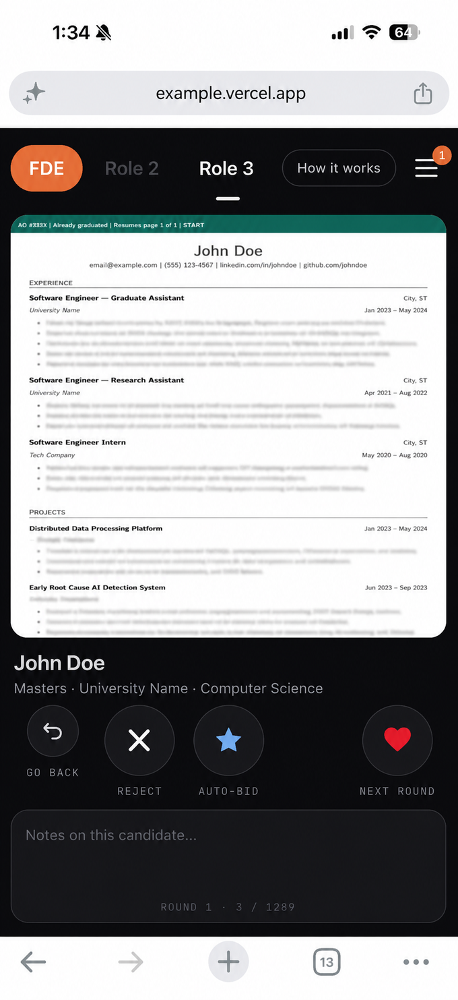
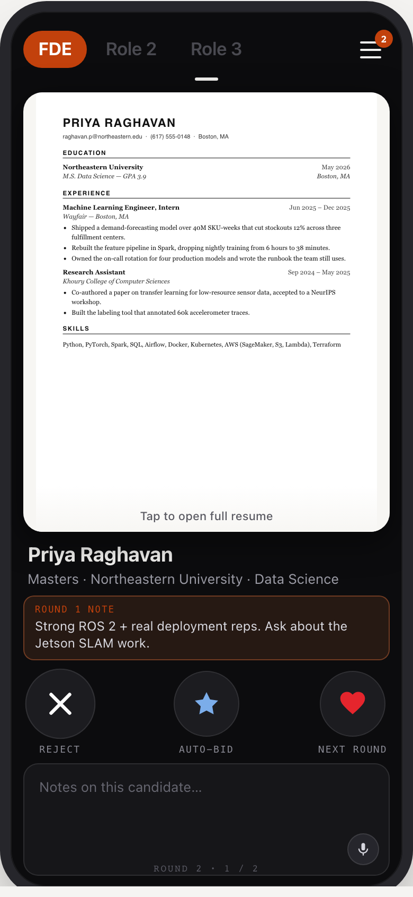
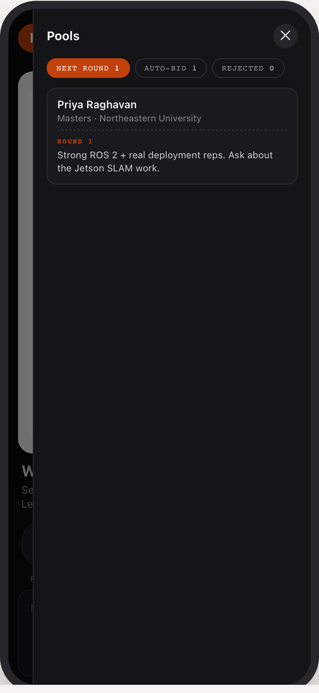

<div align="center">


</div>

My boss **HATED** reviewing resumes, so 1,500 applicants crawled **INCONSISTENTLY** through a desk-bound spreadsheet **WHEN** he was almost never at a desk... but he **LOVED** Tinder. So I gamified hiring into a swipe app he could run from his phone anywhere, and screen-to-hire time dropped 80%. Built it for him (<ins>and now you ;)</ins>).

Built by [Jason Munguia](https://github.com/jasonmunguia). Apache-2.0 — free to use, fork and build on, **with credit**.

<div align="center">

<br>

**Screen hundreds of resumes the way you swipe on a phone.**<br>
One resume fills the screen. Three buttons decide. The survivors come back as a
smaller pile, and you go again until the stack is interview-sized.

<br>



<br>
<sub><i>Round 1, candidate 3 of 1,289. Details anonymised.</i></sub>

<br><br>

<a href="#the-fastest-way-to-use-this"><b>Get started</b></a> &nbsp;·&nbsp;
<a href="#before-anything-else-label-the-resumes"><b>Label your PDF</b></a> &nbsp;·&nbsp;
<a href="docs/ui-mockup.html"><b>Try the UI</b></a> &nbsp;·&nbsp;
<a href="#access-and-privacy--read-this-once"><b>Privacy</b></a>

<br>

<sub>
  
  
  
</sub>

</div>

---

Built for the case where a job posting gets 1,800 applicants and nobody has
20 hours to read them.

> **See it before you build it:** open [`docs/ui-mockup.html`](docs/ui-mockup.html)
> in a browser. It's a self-contained, fully interactive mockup with synthetic
> candidates — swipe the cards, open the pools, watch a note carry into round 2.
> No install, no data, no accounts.

---

## The fastest way to use this

**Setup: 30–60 minutes.** Most of that is labelling your PDF so the pipeline
knows where each resume starts, which is the one part only you can do.

Paste this into Claude Code, Cursor, Codex, or any coding agent, from inside a
folder where you want the project:

```
Set up https://github.com/jasonmunguia/open-hire for me.
Read AGENTS.md and follow it. My resume PDF is at <path to your PDF>.
Do everything you can without me, then give me a numbered list of what I have
to do by hand.
```

The agent will clone it, install everything, ingest your PDF, run the tests,
and then stop and tell you exactly which accounts you need to create. It cannot
sign up for services on your behalf — nothing can — so that part is a short
checklist rather than a surprise.

If you would rather do it yourself, the whole thing is below.

---

## What you get

- **One resume per screen.** Tap to open it full-page, tap again to go back.
- **Four buttons.** Go Back (undo), Reject, Auto-Bid, Next Round.
- **Notes per candidate** — kept only if you advance them, and shown again the
  next time that person comes around, stamped with the round you wrote them in.

  
- **Rounds.** A round cannot end until everyone in it has a decision. Then the
  survivors form the next, smaller round.
- **Auto-Bid** is a fast-track: those people skip the middle rounds entirely and
  rejoin only at the finals.
- **A hard cap.** Screening stops when the final pool fits under 50 people.
- **Nothing is ever deleted.** Every pool is listed and reversible, with every
  note still attached.

  
- **Works on a laptop and a phone.** Drag the card, or use the arrow keys.

Cost to run: **$0** on the free tiers of Vercel and Supabase, for a few thousand
candidates.

---

## Before anything else: label the resumes

**This is the step that decides whether any of this works.**

The pipeline has to know where one person's resume ends and the next begins. If
your PDF is one long stack with no structure, it has to guess from page layout —
and a wrong guess means a reviewer rejects someone based on a stranger's resume.

So give it structure first. In order of preference:

### Option A — a spreadsheet with page numbers (most reliable)

A `.xlsx` or `.csv` with one row per candidate and a column giving the page
their resume starts on. Column names are matched loosely, so any of these work:

| What it means | Accepted column headers |
|---|---|
| Name | `Name`, `Candidate Name`, `Full Name`, `Applicant` |
| Email | `Email`, `Email Address`, `E-Mail` |
| Start page | `PDF Start Page`, `Start Page`, `Page`, `PDF Page` |
| Length | `Resume Pages`, `Pages`, `Page Count` |
| School | `School`, `University`, `Institution` |
| Year | `School Year`, `Year`, `Class Year`, `Level` |
| Major | `Majors`, `Major`, `Degree` |
| ID | `Candidate ID`, `ID`, `Applicant ID` |

Only `Name` and a start-page column are required. Everything else enriches the
card and the contact export.

### Option B — bookmarks in the PDF (also exact)

If the PDF has an outline with one entry per resume, that is used automatically.
Titles like `#0001 — Jane Doe`, `12. Jane Doe`, or just `Jane Doe` all parse; a
short prefix becomes the candidate's ID.

**Ask ChatGPT (or any assistant with file access) to build this for you:**

> I'm uploading a PDF containing many resumes stacked back to back. For every
> resume, find the page it starts on and the person's name.
>
> Give me back a CSV with these exact columns:
> `Candidate ID, Name, Email, School, School Year, Majors, PDF Start Page, Resume Pages`
>
> Number the candidates sequentially from #0001 in the order they appear in the
> PDF. `PDF Start Page` must be the 1-based page number where that person's
> resume begins, and `Resume Pages` how many pages it runs before the next
> person starts. Do not skip anyone, and do not merge two people into one row.
> If you cannot determine a field, leave it empty rather than guessing.

Then save the CSV and pass it with `--roster`. **Spot-check ten rows against the
PDF before you trust it** — an assistant that hallucinates a page number will
produce confidently wrong pairings, and this tool cannot detect that for you.

### Option C — a roster table printed in the PDF

Some job boards export a table of applicants in the first pages, then the
resumes in the same order. That is detected automatically and matched on name
and email. Expect around 98% of candidates to be paired exactly; the rest are
flagged for you to check by hand.

### Option D — nothing at all

The pipeline guesses from font size and contact details near the top of a page,
and flags **every** candidate as `heuristic`. Treat that output as a draft.

---

## Setup, step by step

### 1. Get the code running locally

You need **git**, **Node 20.9 or newer**, and **Python 3.10 or newer**
(`node --version` / `python3 --version` to check; installers at
https://nodejs.org and https://www.python.org/downloads/).

```bash
git clone https://github.com/jasonmunguia/open-hire.git
cd open-hire
npm install
python3 -m pip install -r requirements.txt
```

Check it works before touching anything else:

```bash
npx vitest run                    # round logic
python3 -m pytest tests -q        # pipeline, against a synthetic PDF
```

Both suites should pass with no accounts, no keys, and no data.

### 2. Ingest your PDF

```bash
# Boundaries only, no images — fast. Check the report before committing.
python3 -m pipeline.ingest --pdf resumes.pdf --roster roster.csv \
  --out assets --skip-images
```

Read what it prints: which strategy it chose, how many candidates it found, and
how many are flagged. **If the count is wildly off, stop and fix the labelling —
everything downstream inherits this mistake.**

When it looks right, run it properly:

```bash
python3 -m pipeline.ingest --pdf resumes.pdf --roster roster.csv --out assets
```

This writes one PDF and one WebP image per page into `assets/`, plus
`assets/manifest.json`. Nothing has left your machine yet.

### 3. Create a database — Supabase (free)

1. Sign up at **https://supabase.com/dashboard/sign-in** (GitHub login is fine)
2. **https://supabase.com/dashboard/new** — new project, any name and region.
   Save the database password it makes you set.
3. Project Settings → Database → Connection string → **Transaction pooler**
4. Copy that string. Replace `[YOUR-PASSWORD]` with your real password.

> **URL-encode special characters in the password.** A `#` becomes `%23`, an `@`
> becomes `%40`. A raw `#` silently truncates the connection string and you get a
> baffling authentication error.

> Use the **pooler** string, not "direct connection". Supabase dropped IPv4 for
> direct connections on the free tier, so the direct one fails with `ENOTFOUND`.

### 4. Fill in your environment

Do this **before** step 5, which writes into this same file.

```bash
cp .env.example .env.local
```

Edit `.env.local` and set `DATABASE_URL` to the pooler string from step 3, and
`JOB_ID` to any short name for this posting. `JOB_TITLE` is optional but worth
setting — it becomes the browser-tab title and the job's name in the database;
without it your screener is called "Open Hire".

Leave `BLOB_READ_WRITE_TOKEN` as it is. That value is a placeholder ending in
`...`, and step 5 replaces it with your real token.

> **Never run `cp .env.example .env.local` a second time.** It overwrites the
> whole file, including the real blob token, and puts the placeholder back.

### 5. Create hosting and file storage — Vercel (free)

1. Sign up at **https://vercel.com/signup** (GitHub login is fine)
2. Install and log in the CLI:

```bash
npm i -g vercel
vercel login
```

3. From the project folder, claim a name — this becomes your URL:

```bash
vercel link --yes --project my-hiring-app
vercel blob create-store resumes --access public --yes
```

That second command creates the image store **and writes your real
`BLOB_READ_WRITE_TOKEN` into `.env.local`,** replacing the placeholder.

Open `.env.local` and check. The line should be a long string starting
`vercel_blob_rw_` — **not** the placeholder ending in `...`. If it still ends in
`...`, pull the token from the linked project:

```bash
vercel env pull .env.local
```

### 6. Upload and load

```bash
node scripts/upload.mjs        # images to blob storage; resumable
node scripts/load.mjs          # schema + candidates into Postgres
```

`load.mjs` is safe to re-run. It merges by email rather than duplicating, and
never blanks a field a previous run filled.

### 7. Deploy

```bash
vercel env add DATABASE_URL production      # paste the same value
vercel env add JOB_ID production
vercel env add JOB_TITLE production         # only if you set it locally
vercel --prod --yes
```

Open the URL it prints. You should see the first candidate's resume with the
four buttons under it — that is the link you send to whoever is screening. If
you get a Vercel login page instead, that is step 8.

### 8. Turn off Vercel's login wall

By default Vercel may require a Vercel account to view your deployment, which
means your reviewer cannot open it. In the Vercel dashboard:

**Project → Settings → Deployment Protection → set Vercel Authentication to
Disabled → Save.**

---

## What the agent can and cannot do for you

Being blunt about this, because the difference is where people get stuck.

| Step | Automatic |
|---|---|
| Clone, install, run tests | Yes |
| Ingest your PDF, render images, build the manifest | Yes |
| Apply the schema, load candidates, upload images | Yes, once keys exist |
| Deploy and verify the live site | Yes, once logged in |
| **Create a Supabase account and project** | **No — browser signup** |
| **Create a Vercel account and log in the CLI** | **No — browser signup** |
| **Turn off Deployment Protection** | **No — dashboard toggle** |
| **Confirm the boundary labelling is correct** | **No — only you can check** |

An agent following `AGENTS.md` will do everything in the first group, then hand
you a numbered list of the rest.

---

## Access and privacy — read this once

**This app ships with no login.** Anyone with the URL can read every resume,
including names, emails and phone numbers. That is a deliberate default for a
tool one trusted person uses for an afternoon, and a bad default for anything
else.

You are putting real people's contact details on the public internet. At minimum:

- Do not use an obvious URL like `acme-hiring.vercel.app` if the postings are
  confidential.
- **Never commit `assets/`, your PDF, or your roster.** `.gitignore` already
  blocks `*.pdf`, `*.xlsx`, `*.csv` and `assets/` — leave those rules alone.
- Delete the blob store and database when you are finished hiring.

If you need a real gate, create a `middleware.ts` at the repo root — Next.js
runs it on every request; it does not exist yet — and a shared passcode is
about thirty lines.

---

## How screening actually works

**Round 1** is everyone. Go through the whole stack — a two-second gut call each.
A round cannot end early; if you stop halfway, you resume exactly where you were.

**Round 2** is whoever you hearted. Smaller pile, slower look. Your note from
round 1 is sitting above the notes box.

**Repeat** until the survivors plus your auto-bids fit under 50. Then they merge
into one final pool and that is your shortlist.

**Auto-Bid** means "I already know I want this one." They leave the stack
immediately and skip every middle round. If your auto-bid pile alone reaches 50,
screening redirects at that pile so you can cut it down — the cap is never
exceeded.

**Undo** deletes the most recent decision. Decisions are an append-only log and
the round state is recomputed from it every time, so undo restores the previous
state exactly, including stepping back across a round boundary.

Change `TOP_N` in `lib/rounds.ts` if 50 is the wrong number for you.

Two other things you may want to make yours: `JOB_TITLE` in `.env.local` sets
the browser-tab title, and the header chips at the top of `app/page.tsx`
(`FDE`, `Role 2`, `Role 3`) are hard-coded display placeholders from the
original deployment — renaming the first one to your role is a one-line edit,
and something to ask your agent for by name.

---

## Project layout

```
app/                  Next.js app — one page plus four API routes
  page.tsx            the entire review UI
  api/candidates      serves the next candidate and the round state
  api/decisions       records a decision; discards notes on reject
  api/pools           the Next Round / Auto-Bid / Rejected lists
  api/undo            deletes the newest decision
lib/rounds.ts         all round logic; pure functions, no database
lib/db.ts             Postgres connection
pipeline/
  ingest.py           CLI: PDF in, assets + manifest out
  strategies.py       the four ways to find resume boundaries
  render.py           slicing and image rendering
  extract.py          text, email and phone extraction
  schema.sql          three tables
scripts/
  upload.mjs          images to blob storage
  load.mjs            manifest to Postgres
tests/                21 pipeline tests, 12 round-logic tests
docs/ui-mockup.html   standalone interactive UI mockup
```

## Troubleshooting

**`ENOTFOUND db.xxx.supabase.co`** — you used the direct connection string. Use
the transaction pooler one.

**Authentication fails but the password is right** — a special character in the
password needs URL-encoding. `#` → `%23`.

**Images do not load** — `scripts/upload.mjs` did not finish, or `load.mjs` ran
before it. Run upload, then load again.

**`upload.mjs` prints a FAIL line for every image** — your blob token is wrong,
usually because `.env.local` was overwritten by a second
`cp .env.example .env.local`. Check the `BLOB_READ_WRITE_TOKEN` line: if it ends
in `...` it is the placeholder, not a token. Run `vercel env pull .env.local` to
restore the real one, then re-run upload. It resumes where it stopped.

**"No such module: fitz"** — `python3 -m pip install -r requirements.txt`. The package is
called PyMuPDF but imports as `fitz`.

**The candidate count is wrong after ingest** — the boundary strategy misread
your PDF. Re-read "Before anything else: label the resumes"; a roster CSV
fixes it.

**`error: externally-managed-environment` from pip** — your system Python
(Homebrew, Debian/Ubuntu) refuses global installs. Make a virtual environment
and use it for every Python command after:
`python3 -m venv .venv && source .venv/bin/activate`, then re-run the install.

**Vercel says you are out of blob operations** — uploads are metered on free
plans, reads are not. The meter stops once your images are up.

## License

Apache-2.0. Use it, change it, sell it — keep the NOTICE and the credit.
